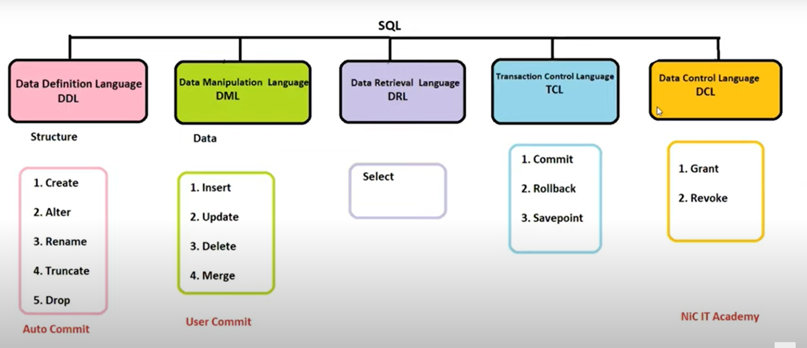

# LearnSQL
**Data Types In SQL**
- **Numeric**
  - int
  - double
  - decimal
  - float
  - number
  - number(6) -> 999999 It consits of six digit
  - nuumber(8,2) -> 999999.99 It consist of 8 digit in that last 2 digit are decimal
  - number(2,2) -> 0.99 It consist of 2 digit in that all that 2 digits are decimal 

- **Character**
  - char  -> will occupy null spaces (max 2000 bytes) for ex: char(20) -> "Kishore  10          20" see here the remaining 16 spaces are occupied
  - varchar()  -> 2000 bytes now deprecated when you use varchar it automatically changes to varchar2
  - varchar2() -> 4000 Bytes max : It will not occupy null spaces

- **Date**
  - default 24-jul-03
  - to change the default formatt we use **to_date('24/07/2003','mm/dd/yyyy')

- **LOB** -> Large object
  - Max 2 Gb of data - character more than 4000 bytes audio file, video file.
  - **CLOB** -> Character large object meaning character more than 4000 bytes
  - **BLOB** -> Binary Large Object meaning Video file, audio file

