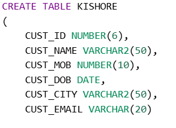
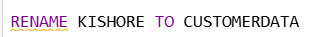
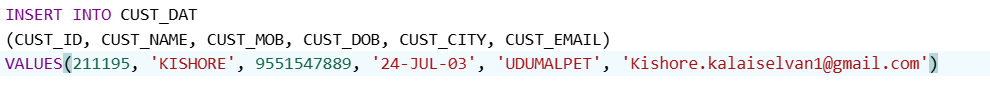
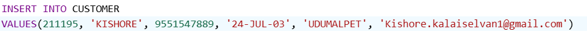

# LearnSQL
**Data Types In SQL**
- **Numeric**
  - int
  - double
  - decimal
  - float
  - number
  - number(6) -> 999999 It consits of six digit
  - nuumber(8,2) -> 999999.99 It consist of 8 digit in that last 2 digit are decimal
  - number(2,2) -> 0.99 It consist of 2 digit in that all that 2 digits are decimal 

- **Character**
  - char  -> will occupy null spaces (max 2000 bytes) for ex: char(20) -> "Kishore  10          20" see here the remaining 16 spaces are occupied
  - varchar()  -> 2000 bytes now deprecated when you use varchar it automatically changes to varchar2
  - varchar2() -> 4000 Bytes max : It will not occupy null spaces

- **Date**
  - default 24-jul-03
  - to change the default formatt we use **to_date('24/07/2003','mm/dd/yyyy')

- **LOB** -> Large object
  - Max 2 Gb of data - character more than 4000 bytes audio file, video file.
  - **CLOB** -> Character large object meaning character more than 4000 bytes
  - **BLOB** -> Binary Large Object meaning Video file, audio file

**DDL -> WORKS ON STRUCTURE OF THE TABLE**
 - Meaning *CREATE ALTER RENAME TRUNCATE DROP* 
 - To Clear/Earse data inside the table We Use TRUNCATE
 - To Delete whole table We Use DROP
 - **NOTE: THIS TRUNCATE AND DROP STATEMENTS CANNOT BE ROLL BACK**  
 
**DML -> WORKS ON MANI PULATING THE DATA**
 - Meaning *INSERT UPDATE DELETE MERGE* 
 - DELETE Can br Roll backed  

**DRL -> WORKS ON RETRIVEL OF DATA**  
**TCL -> WORKS ON TRANSACTION CONTROL**  
**DCL -> WORKS ON CONTROL OF DATA**  
-------------------------------------------------------------------------
-**TO CREATE TABLE**
 - 
 - HERE *KISHORE* IS THE TABLE-NAME

-**TO RENAME TABLE NAME**
 - 
 - *KISHORE* IS THE OLD NAME *CUSTOMERDATA* IS A NEW NAME

-**TO INSERT TABLE DATA**
 - 
 - HERE WE CAN LEAVE SOME COLUMNS WHEN IT IS NEEDED

 -**WE HAVE ANOTHER WAY TOO**
 -
 - BUT HERE WE NEED TO GIVE VALUES TO ALL THE COLUMNS THAT EXISTS IN THE TABLE

-**TO ALTER TABLE DATA**
 - 
 - I HAVE GIVEN SIZE FOR EMAIL AS 20 NOW I NEED TO MODIFY 50 